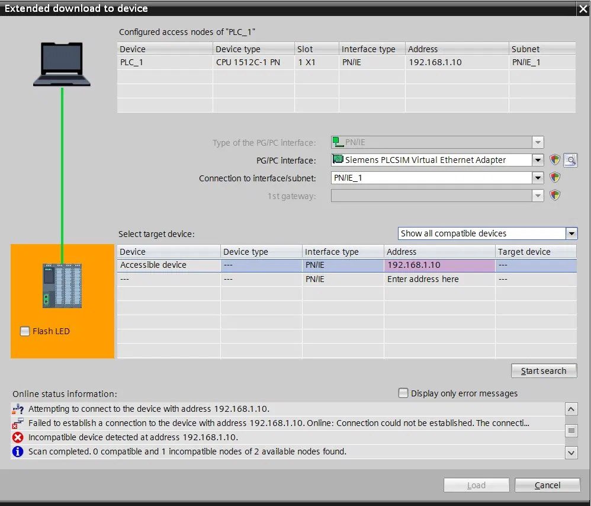
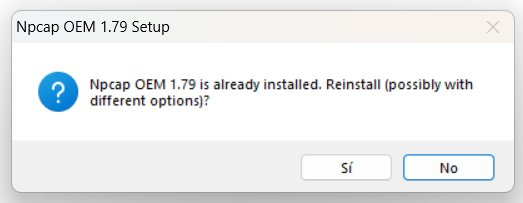
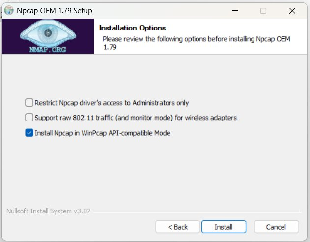

# 🛠️ Solucionador de problemas: PLCSIM Advanced - Error "Incompatible Device"

[⬅️ Volver al README principal](../../README.md)

---

## 🚨 Síntoma

Al intentar descargar un proyecto al PLC virtual desde TIA Portal con S7-PLCSIM Advanced V7, aparece el siguiente comportamiento:

- ❌ Mensaje: **"Failed to establish a connection to the device with address 192.168.X.X"**
- ❌ Mensaje: **"Incompatible device detected at address 192.168.X.X"**
- ❌ El botón **Load** permanece deshabilitado
- ❌ El dispositivo aparece en rojo o como "Accessible device" pero no asociable

### Captura del problema



---

## 🔍 Causa raíz

La causa más común de este error **NO es de versiones de TIA Portal ni de PLCSIM**. El problema real está en el driver de red **Npcap**, que se instala junto con PLCSIM Advanced.

**El instalador de PLCSIM Advanced puede configurar Npcap sin marcar la opción crítica `WinPcap API-compatible Mode`**, lo que provoca que el adaptador virtual de PLCSIM no funcione correctamente para la comunicación con TIA Portal.

---

## ✅ Solución: Reinstalar Npcap con la configuración correcta

### Descargar instalador de Npcap

🔗 **[Descargar Npcap OEM desde Google Drive](https://drive.google.com/file/d/1o0Jj1D5fCAWuRJ-BcHK_m9_58cdDGa-Z/view?usp=sharing)**

> Alternativamente, el instalador `npcap-X.XX-oem.exe` viene incluido dentro del ISO de S7-PLCSIM Advanced V7 (puedes montarlo y buscarlo).

---

## 📋 Procedimiento paso a paso

### Paso 1 — Cerrar todos los programas que usen red

1. Cierra **TIA Portal V21** completamente
2. Cierra **S7-PLCSIM Advanced** (click derecho en bandeja → Exit)
3. Cierra navegadores con `https://localhost` o cualquier acceso a Unified
4. Si tienes **Wireshark** abierto, ciérralo
5. Cierra cualquier aplicación que use captura de red

### Paso 2 — Ejecutar el instalador de Npcap

1. **Click derecho** sobre `npcap-1.79-oem.exe` (o la versión que descargaste)
2. Selecciona **"Ejecutar como administrador"**
3. Si Windows pregunta si quieres reinstalar la versión actual, click **Sí**

### Paso 3 — Aceptar términos

Acepta el contrato de licencia y avanza con **Next**.

### Paso 4 — Configuración crítica de opciones

⚠️ **ESTE ES EL PASO MÁS IMPORTANTE.** Configura las opciones exactamente así:



| Opción | Estado correcto | Razón |
|---|---|---|
| Restrict Npcap driver's access to Administrators only | ⬜ **Desmarcado** | Permite que PLCSIM Advanced funcione sin elevación constante |
| Support raw 802.11 traffic (and monitor mode) for wireless adapters | ⬜ **Desmarcado** | Solo necesario para análisis Wi-Fi con Wireshark; causa conflictos con PLCSIM |
| **Install Npcap in WinPcap API-compatible Mode** | ✅ **MARCADO** | **CRÍTICO** - PLCSIM Advanced usa la API antigua de WinPcap |

> Si aparece un diálogo preguntando si quieres reinstalar (porque ya tienes Npcap previamente), acepta con **Sí**:
>
> 

### Paso 5 — Instalación

1. Click en **Install**
2. Espera unos segundos mientras instala el driver
3. **Pueden aparecer parpadeos en la conexión de red** (Wi-Fi desconecta/reconecta brevemente) — es normal
4. Click **Next** → **Finish**

### Paso 6 — Reiniciar el PC

🔴 **OBLIGATORIO.** El driver de red necesita registrarse al inicio de Windows. Sin reinicio, no funciona.

---

## ✅ Verificación de la solución

### Verificación 1 — Servicio Npcap RUNNING

1. **Win + S** → busca `cmd`
2. **Click derecho** → **Ejecutar como administrador**
3. Escribe:
   ```
   sc query npcap
   ```
4. Debe aparecer:
   ```
   STATE : 4 RUNNING
   ```

### Verificación 2 — Adaptador virtual operativo

En el mismo CMD:
```
ipconfig /all
```

Busca:
```
Adaptador de Ethernet Ethernet X:
   Descripción . . . . . . : Siemens PLCSIM Virtual Ethernet Adapter
   Dirección física. . . . : XX-XX-XX-XX-XX-XX
   Dirección IPv4. . . . . : 192.168.X.X
   Máscara de subred. . . : 255.255.255.0
```

Si aparece y tiene IP asignada, el adaptador está operativo.

### Verificación 3 — Configuración IP del adaptador

Si el adaptador no tiene IP, asígnale una manualmente:

1. **Panel de control** → Centro de redes y recursos compartidos
2. Click en **"Cambiar configuración del adaptador"**
3. Click derecho sobre **Siemens PLCSIM Virtual Ethernet Adapter** → Propiedades
4. Doble click en **Protocolo de Internet versión 4 (TCP/IPv4)**
5. Selecciona **"Usar la siguiente dirección IP"**:
   - IP: `192.168.1.50` (diferente a la del PLC virtual)
   - Máscara: `255.255.255.0`
   - Sin gateway
6. Aceptar

⚠️ **Importante:** La IP del adaptador virtual debe estar en la **misma subred** que la IP configurada en el PLC virtual en TIA Portal. Si el PLC está en `192.168.1.10`, el adaptador puede estar en `192.168.1.50`.

---

## 🎯 Probar la descarga

Después de la configuración:

### 1. Arrancar PLCSIM Advanced

1. Abre **S7-PLCSIM Advanced V7** como administrador
2. Configurar:
   - Online Access: **TCP/IP Single Adapter**
   - TCP/IP communication with: **`<Local>`** o **Ethernet**

### 2. Crear instancia del CPU

- Instance name: `CPU_Sim`
- IP address: `192.168.1.10`
- Subnet mask: `255.255.255.0`
- PLC family: S7-1500
- Click **Start**

La tarjeta de la instancia debe aparecer con LED amarillo (STOP esperando proyecto).

### 3. Descargar desde TIA Portal

1. Click derecho sobre **PLC_1** → **Download to device → Hardware and software (all)**
2. Configurar:
   - Type of PG/PC interface: **PN/IE**
   - PG/PC interface: **Siemens PLCSIM Virtual Ethernet Adapter**
3. Click **Start search**
4. Debe aparecer el CPU virtual encontrado
5. Click **Load** → confirmar
6. El CPU virtual debe pasar a **RUN (LED verde)**

---

## 📊 Diagnóstico avanzado

Si después de seguir todos los pasos el problema persiste, verifica:

### Conflictos con otros softwares de red

Verifica que no haya estos programas activos:
- **VMware Workstation** (puede capturar adaptadores virtuales)
- **VirtualBox** (similar conflicto)
- **Hyper-V** (deshabilitar temporalmente)
- **WinPcap antiguo** (debe estar removido)

Para deshabilitar Hyper-V temporalmente:
```
bcdedit /set hypervisorlaunchtype off
```
Reinicia el PC.

Para volver a habilitarlo:
```
bcdedit /set hypervisorlaunchtype auto
```

### Firewall

Verifica que el Firewall de Windows permita PLCSIM Advanced:

1. **Panel de control** → Firewall → Permitir programa
2. Verifica que aparezcan permitidos:
   - S7-PLCSIM Advanced
   - Siemens.Simatic.Simulation.Runtime.dll

### Antivirus

Algunos antivirus bloquean drivers de captura de paquetes:
- **Kaspersky:** agrega Npcap a excepciones
- **ESET:** desactiva temporalmente protección de red
- **Norton:** agrega carpeta Siemens a excepciones

---

## 📝 Resumen del fix

```
Problema:    "Incompatible device" en descarga PLCSIM Advanced
Causa:       Npcap sin WinPcap API-compatible Mode
Solución:    Reinstalar Npcap marcando opciones correctas + reiniciar
Tiempo:      ~15 minutos
Éxito:       95% de los casos reportados
```

---

## 🎓 Lección aprendida

Este es un excelente caso para enseñar a tus aprendices sobre la **importancia de los drivers de bajo nivel** en sistemas industriales:

> "En automatización industrial, no basta con que el software de alto nivel funcione — los drivers de red, los servicios de Windows y la configuración del sistema operativo son tan importantes como el código del PLC. Un mismo problema puede manifestarse de forma engañosa, y la solución suele estar en componentes que no son visibles desde la herramienta principal."

---

[⬅️ Volver al README principal](../../README.md)
